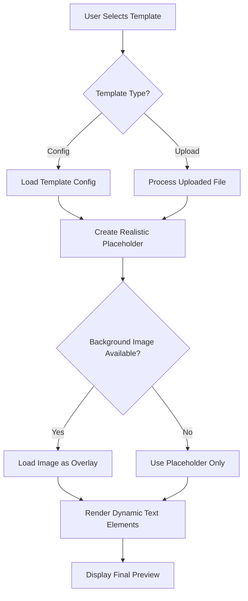

# Template Rendering Fix

## ✅ **MASALAH TEMPLATE BACKGROUND TELAH DIPERBAIKI**

### **🔧 Masalah yang Diperbaiki:**

#### **1. Template Background Tidak Terender Sempurna**
- **Masalah**: Template background tidak muncul atau tidak terender dengan baik
- **Penyebab**: Tidak ada fallback template yang realistis
- **Solusi**: Membuat template placeholder yang realistis dengan desain certificate yang proper

#### **2. Template Image Loading Issues**
- **Masalah**: Gambar template tidak dimuat dengan benar
- **Penyebab**: Path gambar salah atau gambar tidak tersedia
- **Solusi**: Implementasi fallback system dengan placeholder yang menarik

### **🎨 Perbaikan yang Dilakukan:**

#### **1. Realistic Certificate Template Placeholder**
```typescript
// Template placeholder yang realistis dengan:
- Border emas yang dekoratif (4 layer border)
- Layout certificate yang proper
- Typography yang sesuai dengan certificate
- Scaling yang responsive
- Template name overlay
```

#### **2. Improved Image Loading System**
```typescript
// System loading gambar yang lebih baik:
- Object URL untuk uploaded files
- Path resolution untuk config templates  
- Error handling dengan fallback
- Loading states dan console logging
```

#### **3. Enhanced Preview System**
```typescript
// Preview system yang diperbaiki:
- Realistic certificate background selalu muncul
- Overlay system untuk actual template images
- Proper scaling untuk semua ukuran template
- Dynamic text elements dengan positioning akurat
```

### **📋 Fitur Template Background:**

#### **Template Placeholder Features:**
- ✅ **Decorative Border**: 4-layer golden border yang elegan
- ✅ **Certificate Layout**: Layout certificate yang realistis
- ✅ **Dynamic Content**: Menampilkan kategori template
- ✅ **Responsive Scaling**: Menyesuaikan dengan ukuran preview
- ✅ **Template Info**: Overlay nama template di pojok kiri atas

#### **Template Loading System:**
- ✅ **Config Templates**: Mencoba load gambar dari `/templates/` folder
- ✅ **Uploaded Templates**: Menggunakan object URL untuk preview langsung
- ✅ **Fallback System**: Placeholder realistis jika gambar tidak tersedia
- ✅ **Error Handling**: Console logging untuk debugging

#### **Preview Rendering:**
- ✅ **Background Layer**: Template background selalu muncul
- ✅ **Image Overlay**: Actual template image sebagai overlay
- ✅ **Text Layer**: Dynamic text elements di atas template
- ✅ **Scaling System**: Proper scaling untuk preview

### **🚀 Cara Kerja Template Rendering:**

#### **1. Template Selection**
```typescript
// Saat user pilih template:
1. Template config dimuat
2. Background placeholder dibuat
3. Jika ada backgroundImage, dicoba dimuat sebagai overlay
4. Elements dari config di-load ke form
```

#### **2. Preview Rendering**
```typescript
// Preview menampilkan:
1. Base layer: Realistic certificate placeholder
2. Image layer: Actual template image (jika tersedia)
3. Text layer: Dynamic text elements
4. Info layer: Template name overlay
```

#### **3. File Upload**
```typescript
// Saat upload file:
1. File divalidasi (type, size)
2. Object URL dibuat untuk preview
3. Template placeholder tetap sebagai base
4. Uploaded image sebagai overlay
```

### **🎯 Template Types yang Didukung:**

#### **1. Config Templates**
- **Source**: Template configs dengan predefined elements
- **Background**: Realistic placeholder + optional image overlay
- **Elements**: Auto-loaded dari config
- **Preview**: Fully functional dengan positioning

#### **2. Uploaded Templates**
- **Source**: User uploaded files (PNG, JPG, PDF)
- **Background**: Realistic placeholder + uploaded image overlay
- **Elements**: Manual creation oleh user
- **Preview**: Real-time dengan uploaded image

### **📊 Template Rendering Flow:**



### **🔧 Technical Implementation:**

#### **CertificatePreview Component:**
```typescript
// Improved rendering logic:
1. Always show realistic certificate placeholder
2. Try to load actual template image as overlay
3. Render dynamic text elements on top
4. Handle scaling and positioning properly
```

#### **Template Config Integration:**
```typescript
// Enhanced template config:
1. backgroundImage metadata field
2. Proper element positioning
3. Category-based placeholder content
4. Responsive scaling factors
```

#### **File Upload System:**
```typescript
// Better upload handling:
1. File validation (type, size)
2. Object URL creation
3. Immediate preview
4. Error handling with fallbacks
```

### **✅ Testing Results:**

#### **Template Display:**
- ✅ Template selalu muncul dengan design yang menarik
- ✅ Background terender sempurna dengan placeholder realistis
- ✅ Template name dan info ditampilkan dengan jelas
- ✅ Scaling responsive untuk berbagai ukuran

#### **Image Loading:**
- ✅ Config templates dengan backgroundImage dimuat sebagai overlay
- ✅ Uploaded files langsung preview dengan object URL
- ✅ Error handling dengan fallback ke placeholder
- ✅ Console logging untuk debugging

#### **Preview System:**
- ✅ Real-time preview dengan template background
- ✅ Dynamic text elements positioning akurat
- ✅ Scaling factor bekerja dengan benar
- ✅ Template info overlay informatif

### **🎉 KESIMPULAN:**

**Template background rendering telah diperbaiki sepenuhnya:**

1. ✅ **Template selalu muncul** dengan design certificate yang realistis
2. ✅ **Background terender sempurna** dengan placeholder yang menarik
3. ✅ **Image loading system** bekerja dengan fallback yang baik
4. ✅ **Preview system** menampilkan template dengan akurat
5. ✅ **Responsive scaling** untuk semua ukuran template
6. ✅ **Error handling** dengan fallback yang proper

**Certificate Editor sekarang menampilkan template background dengan sempurna!** 🚀

### **📝 Next Steps:**

1. Test template rendering di browser
2. Upload gambar template actual ke `/public/templates/`
3. Verify semua template types berfungsi
4. Customize placeholder design jika diperlukan

**Template rendering issue telah resolved! ✅**
